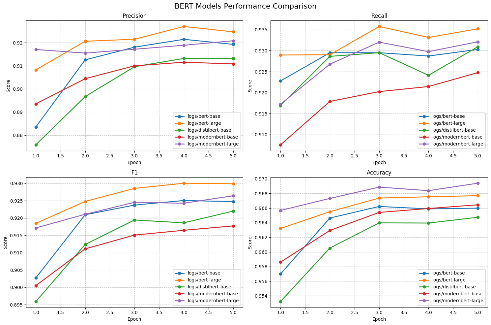
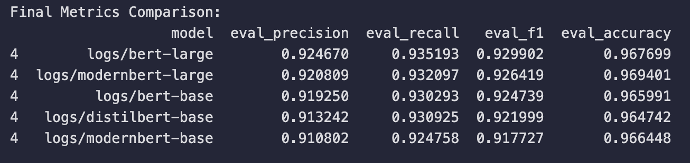

# Fine-Tuning Electrical Engineering Named Entity Recognition (NER) Models

## Overview

This repository focuses on automating Named Entity Recognition (NER) for electrical engineering texts using transformer-based encoder models. We will be making use of [Electrical Engineering NER Dataset - ElectricalNER](https://huggingface.co/datasets/disham993/ElectricalNER) for fine-tuning BERT family models, and then use tools to push the models to the Hugging Face Hub. The project enables efficient entity extraction from technical texts, streamlining tasks like document analysis, data organization, and semantic search.

---

## Features

- **Fine-Tuning Pipeline**: Implements a complete pipeline for fine-tuning models like BERT and ModernBERT.
- **Model Evaluation**: Includes detailed metrics like precision, recall, F1, and accuracy.
- **NER Utilities**: Provides tools for post-processing NER results.
- **Hugging Face Integration**: Pushes fine-tuned models to the Hugging Face Hub with detailed model cards.

---

## Project Structure

```
├── data/                            # Contains tokenized datasets
├── models/                          # Fine-tuned models
├── logs/                            # Training and evaluation logs
├── notebooks/                       # Jupyter notebooks for various stages of the pipeline
│   ├── 01_data_tokenization.ipynb   # Tokenizing and preparing the dataset
│   ├── 02_model_training.ipynb      # Fine-tuning transformer models
│   ├── 03_evaluation.ipynb          # Evaluating model performance
│   ├── 04_inference_local.ipynb     # Performing inference on unseen data - local models
│   ├── 05_push_model_to_hub.ipynb   # Pushing models and cards to Hugging Face Hub
│   ├── 04_inference_hf.ipynb        # Performing inference on unseen data - models that has been pushed to hub
├── utilities/                       # Helper scripts and constants
│   ├── __init__.py                  # Initialize utilities as a package
│   ├── constants.py                 # Configuration and constants
│   ├── helper.py                    # Utility functions for NER and Hugging Face integration
├── README.md                        # Project documentation (this file)
```

---

## Getting Started

### Prerequisites

- Python 3.10+
- Create conda environment:
   ```bash
   conda create -n electrical_ner python=3.11
   conda activate electrical_ner
   ```
- Install required libraries:
   ```bash
   pip install -r requirements.txt
   ```

- Hugging Face Token:
  - Create an account on [Hugging Face](https://huggingface.co/).
  - Generate a personal access token from your account settings.

### Setting Up Environment

- Add the Hugging Face token to a `.env` file:

```env
HF_TOKEN=your_hugging_face_token
```

- Ensure the repository is structured as described above.

### Running the Pipeline

1. **Dataset Preparation**:

   - Run `01_data_tokenization.ipynb` to tokenize and prepare the dataset.

2. **Model Training**:

   - Execute `02_finetuning.ipynb` to fine-tune models on the electrical NER dataset.

3. **Model Evaluation**:

   - Use `03_evaluation.ipynb` to evaluate model performance.

4. **Model Inference - Local Models**:

   - Use `04_inference_local.ipynb` to test the fine-tuned models on unseen data on locally saved models.

5. **Model Upload to Hugging Face Hub**:

   - Use `05_push_to_hub.ipynb` to push models and model cards to the Hugging Face Hub.

6. **Model Inference - Hugging Face Models**:
   - Use `06_inference_hf.ipynb` to test the fine-tuned models on unseen data that has been pushed to the hub.

---

## Results and Evaluation

**Evaluation Metric Plots**



**Final Metrics Comparison**



Refer to the [Medium article](https://medium.com/@d.isham.ai93/automating-electrical-engineering-text-analysis-with-named-entity-recognition-ner-part-2-add03cd99982) for in-depth analysis of these obtained results.

## How to Use the Models

### Inference Example

After deploying a model to the Hugging Face Hub, use the following code snippet for inference:

```python
from transformers import AutoTokenizer, AutoModelForTokenClassification, pipeline
from utilities import clean_and_group_entities

model_name = "disham993/electrical-ner-ModernBERT-large"
tokenizer = AutoTokenizer.from_pretrained(model_name)
model = AutoModelForTokenClassification.from_pretrained(model_name)
nlp = pipeline("ner", model=model, tokenizer=tokenizer, aggregation_strategy="simple")

text = "The Xilinx Vivado development suite was used to program the Artix-7 FPGA."
ner_results = nlp(text)
cleaned_results = clean_and_group_entities(ner_results)
print(cleaned_results)
```

---

## Available Models

The following models are fine-tuned and available on the Hugging Face Hub:

| Model            | Repository                                                               | Description                      |
| ---------------- | ------------------------------------------------------------------------ | -------------------------------- |
| BERT Base        | [Link](https://huggingface.co/disham993/electrical-ner-bert-base)        | Lightweight model for NER.       |
| BERT Large       | [Link](https://huggingface.co/disham993/electrical-ner-bert-large)       | High-accuracy model for NER.     |
| DistilBERT Base  | [Link](https://huggingface.co/disham993/electrical-ner-distilbert-base)  | Efficient model for quick tasks. |
| ModernBERT Base  | [Link](https://huggingface.co/disham993/electrical-ner-ModernBERT-base)  | Advanced base model.             |
| ModernBERT Large | [Link](https://huggingface.co/disham993/electrical-ner-ModernBERT-large) | High-performance NER model.      |

---

## Contributing

Contributions are welcome! To contribute:

1. Fork the repository.
2. Create a new branch (`git checkout -b feature-name`).
3. Commit your changes (`git commit -m 'Add feature'`).
4. Push to the branch (`git push origin feature-name`).
5. Open a pull request.

---

## License

This project is licensed under the MIT License. See the LICENSE file for details.

---

## Contact

For questions or suggestions, feel free to reach out:

- **Name**: Isham Rashik
- **Email**: d.isham.993@gmail.com
- **Hugging Face Profile**: [disham993](https://huggingface.co/disham993)

Let’s revolutionize electrical engineering with state-of-the-art NLP! ⚡
